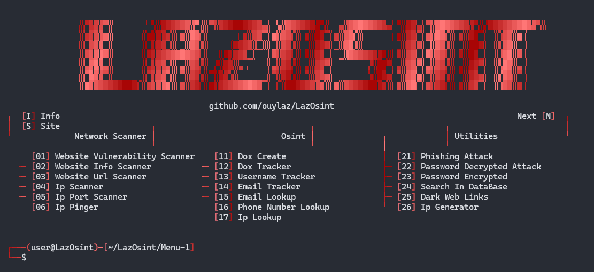
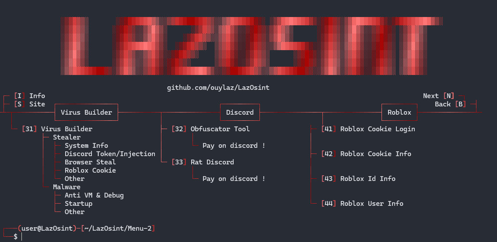
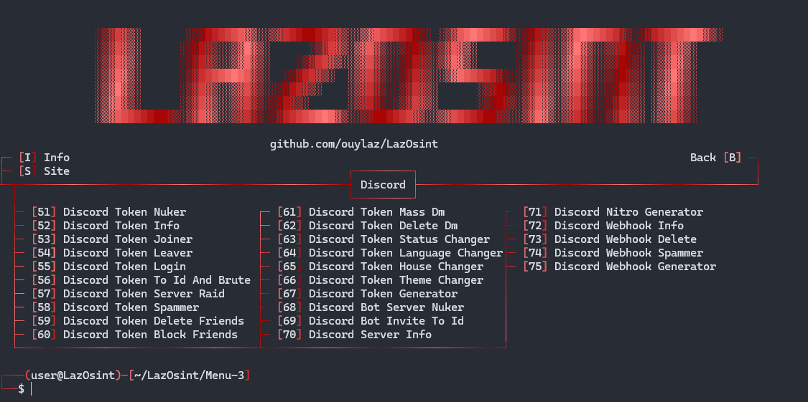

 

<p>
  <h3 align="center">⭐ N'oubliez pas de définir le repository sur "Star" ⭐</h3>
</p>

<h1>📜・Description:</h1>

</p>
  👨‍💻 -> Developpé en <strong>Python</strong>.<br>
  🌍 -> Tool en <strong>Francais</strong>.<br>
  💻 -> Disponible sur <strong>Windows</strong> et <strong>Linux</strong>.<br>
  🔎 -> <strong>Pas de virus</strong> et <strong>backdoor</strong>.<br>
  📂 -> <strong>Open Source</strong> uniquement à des fins de vérification, garantissant l’absence de programmes malveillants.<br>
  🔄 -> <strong>Fréquemment mis à jour</strong>.<br>
  💰 -> <strong>Gratuit</strong> Pour tout le mondes.<br>
  💻 -> Multi-Tools seulement pour les <strong>Professionnel</strong> et ce qui font de la <strong>Cyber-Secutité</strong.<br>
</p>

<h1>⭐・Features: </h1>

<p align="center">
   
   
   
  
</p>

<h1>📄・Pages:<h1>
    - <strong>Page: 1</strong>
<p align="center">
  

<h1>⚙️・Functions:</h1>

```
┌── ⚒️ - LazOsint-Tools
│   ├── Info
│   └── Site
│
├── 💰 - Paid
│   ├── Obfuscator Tool
│   └── Rat Discord
│
├── 🕵️‍♂️ - Network Scanner
│   ├── Sql Vulnerability Scanner
│   ├── Website Scanner
│   ├── Website Url Scanner
│   ├── Ip Scanner
│   ├── Ip Port Scanner
│   └── Ip Pinger
│
├── 🔎 - Osint
│   ├── Dox Create
│   ├── Dox Tracker
│   ├── Username Tracker
│   ├── Email Tracker
│   ├── Email Lookup
│   ├── Phone Number Lookup
│   └── Ip Lookup
│
├── 🔧 - Utilities
│   ├── Phishing Attack
│   ├── Password Decrypted Attack
│   ├── Password Encrypted
│   ├── Search In DataBase
│   ├── Dark Web Links
│   └── Ip Generator
│
├── ☠️ - Virus Builder
│   ├── Stealer
│   │   ├── System Info: User, System, Ip, Disk, Screen, Location, etc.
│   │   ├── Discord Token: Token, Email, Phone, Id, Username, etc.
│   │   ├── Discord Injection: Email/Password Changed, Login, Card/Paypal Added, Nitro Bought, etc.
│   │   ├── Browser Steal: Passwords, History, Cookies, Downloads, Cards, etc.
│   │   ├── Roblox Cookie: Cookie, Id, Username, etc.
│   │   ├── Camera Capture: Record the victim's computer camera.
│   │   └── Screenshot: Capture the victim's computer screen.
│   │
│   └── Malware
│       ├── Block Key
│       ├── Block Mouse
│       ├── Block Task Manager
│       ├── Block AV Website
│       ├── Spam Open Program
│       ├── Fake Error
│       ├── Launch At Startup
│       ├── Anti Vm & Debug
│       └── Restart Every 5min
│
├── 📞 - Discord Tools
│   ├── Token Discord
│   │   ├── Discord Token Info
│   │   ├── Discord Token Nuker
│   │   ├── Discord Token Joiner
│   │   ├── Discord Token Leaver
│   │   ├── Discord Token Login
│   │   ├── Discord Token To Id And Brute
│   │   ├── Discord Token Server Raid
│   │   ├── Discord Token Spammer
│   │   ├── Discord Token Delete Friends
│   │   ├── Discord Token Block Friends
│   │   ├── Discord Token Mass Dm
│   │   ├── Discord Token Delete Dm
│   │   ├── Discord Token Status Changer
│   │   ├── Discord Token Language Changer
│   │   ├── Discord Token House Changer
│   │   ├── Discord Token Theme Changer
│   │   └── Discord Token Generator
│   │
│   ├── Bot Discord
│   │   ├── Discord Bot Server Nuker
│   │   └── Discord Bot Invite To Id
│   │
│   ├── Webhook Discord
│   │   ├── Discord Webhook Info
│   │   ├── Discord Webhook Delete
│   │   ├── Discord Webhook Spammer
│   │   └── Discord Webhook Generator 
│   │
│   ├── Discord Server Info
│   └── Discord Nitro Generator
│
└── 🎮 - Games Tools
    ├── Roblox Cookie Login
    ├── Roblox Cookie Info
    ├── Roblox User Info
    └── Roblox Id Info


```

<h1>🔒・Requirements:</h1>

<h3>Windows:</h3>

<p>
- Install <a href="https://www.python.org/downloads/">Python</a> with the <a href="Img/Python_Path.png">PATH</a> options.<br>
- Windows 10 & 11 or +
</p>

<h3>Linux:</h3>

<p>
- Latest version of <a href="https://www.python.org/downloads/">Python</a>.<br>
- Linux recent version.
</p>

<h1>⏳・Installation:</h1>

</p 
>>Installer "LazOsint" dans realease </a>

<p>
  
```
1 - Installer le fichier .zip.
2 - Extraire ou un-zip le fichier.
3 - Ouvrir "Setup.bat" ou "Setup.py".
```
Ou
```
1 - Ouvre le terminal
2 - Ecris "cd LazOsint-Tools"
3 - Ecris "python Setup.py"
```
</p>

<h1>⚠️・Reglement:</h1>

<p>
LazOsint a été développé uniquement à des fins éducatives. Ce projet a été créé avec de bonnes intentions et est destiné à un usage personnel uniquement. En choisissant d'utiliser RedTiger, vous reconnaissez et acceptez l'entière responsabilité de toutes les conséquences pouvant résulter de vos actions.
</p>

<h2>🔗・Credits:</h2>

<p>
  - <a href="https://discord.gg/gbYyWgYp3g">Discord</a><br>
  - Créateur Original : Loxyteck<br>
  - Créateur/Developpeur : ouylaz<br>
  - Version: 152.225
</p>
